````markdown
# 🚀 Centrale Marseille — Machine Learning  
### *From Theory to Production-Ready Systems*

<p align="center">
  <a href="https://docs.google.com/document/d/1jChdyyoHfznAlr0II3ULZVacJYEirG5_EpjSyXSvnJ8/edit">
    
  </a>
  <a href="https://www.linkedin.com/in/sitraka-matthieu-forler/">
    
  </a>
</p>

---

## 🧰 Tech Stack (Industry-Oriented)

<p align="center">
  <a href="https://www.python.org/">
    
  </a>
  <a href="https://www.kaggle.com/">
    
  </a>
  <a href="https://numpy.org/">
    
  </a>
  <a href="https://pandas.pydata.org/">
    
  </a>
  <a href="https://scikit-learn.org/">
    
  </a>
  <a href="https://pytorch.org/">
    
  </a>
</p>

---

## 🗓️ Course Timeline

```mermaid
timeline
    title ML Course Progression
    Novembre : Foundations + Intro ML
              : Applied ML + Team Work
    Décembre : Intermediate Concepts
    Janvier  : Advanced Topics / TBD
````

### 📍 Novembre

* **13/11** — LIRONE #1 *(6h)*
* **25/11** — SITRAKA #2 *(6h)* → *ML Foundations*
* **28/11** — SITRAKA #3 *(6h)* → *ML + Deep Learning + Projects*

### 📍 Décembre

* **19/12** — LIRONE #4 *(6h)*

### 📍 Janvier

* **29/01** — LIRONE #5 *(6h)*
* *TBD (Project / Case Study)*

---

# 🧠 Course Philosophy

> **“A model is useless without a business decision behind it.”**

---

# 👨‍🏫 Courses — SITRAKA

## 🎯 Learning Outcomes

* Design **end-to-end ML pipelines**
* Understand **bias/variance trade-off deeply**
* Choose models based on **constraints (data, latency, interpretability)**
* Translate business problems into **ML formulations**
* Understand **modern AI systems (Transformers, LLMs)**

---

## 🧱 ML System Architecture

```mermaid
flowchart LR
    A[Raw Data] --> B[Data Cleaning]
    B --> C[Feature Engineering]
    C --> D[Model Training]
    D --> E[Evaluation]
    E --> F[Deployment]
    F --> G[Monitoring]
```



---

## 📚 Program (Deep Dive)

### ⚙️ 1. Foundations — Where 80% of ML Happens

* Data Cleaning *(missing values, duplicates, outliers)*
* Feature Engineering *(scaling, encoding, feature creation)*
* Feature Selection *(signal vs noise)*
* Bias-Variance Tradeoff *(overfitting vs underfitting)*
* Metrics Definition *(evaluation strategy)*

**Advanced Concepts**

* Missing data assumptions *(MCAR, MAR)*
* Scaling impact on optimization
* Regularization *(L1 vs L2)*

---

### 📈 2. Supervised Learning — Decision Engines

* Linear Regression *(OLS, Ridge, Lasso)*
* Logistic Regression *(MLE-based)*
* Decision Trees

  * Random Forest *(bagging)*
  * Gradient Boosting *(boosting)*

| Model         | Interpretability | Performance | Scalability |
| ------------- | ---------------- | ----------- | ----------- |
| Linear Models | ⭐⭐⭐⭐             | ⭐⭐          | ⭐⭐⭐⭐        |
| Trees         | ⭐⭐⭐              | ⭐⭐⭐⭐        | ⭐⭐⭐         |
| Boosting      | ⭐                | ⭐⭐⭐⭐⭐       | ⭐⭐          |

**Use Cases**

* Credit Scoring
* Marketing ROI
* Churn Prediction
* Sports Analytics

---

### 🔍 3. Unsupervised Learning — Structure Discovery

* Clustering *(K-Means, Hierarchical)*
* PCA *(dimensionality reduction)*

**Use Cases**

* Customer Segmentation
* Fraud Detection

---

### 🧠 4. Deep Learning — Representation Learning

* Backpropagation *(chain rule)*
* Cross-Entropy Loss

**Architectures**

* CNN *(vision)*
* RNN *(sequences)*
* Transformers *(attention)*

---

### 🤖 5. NLP & Transformers

* NLP Basics
* Word Embeddings → Transformers
* Attention Mechanism

**Applications**

* Financial document parsing
* AML / KYC
* Chatbots

---

# 📖 Resources

## 🔗 Core

* [Feature Engineering Repository](https://github.com/ashishpatel26/Amazing-Feature-Engineering/tree/master?tab=readme-ov-file)
* [Designing Machine Learning Systems](https://amzn.to/4blcjAl)

---

## 🧪 Advanced Topics

* Synthetic Data
* Agent-Based Modelling (ABM)
* [Quant Research Trends](https://topquantunis.com/the-new-quant-times)

---

## 🧠 Articles

* [L’Orange Bleue — Engineering Insight](https://medium.com/@sitrakaforler/lorange-bleue-ce-que-nous-dit-le-si%C3%A8cle-d-or-des-%C3%A9coles-d-ing%C3%A9nieurs-fran%C3%A7aises-sur-notre-25b9f34874bb)

---

## 🛠️ Tools

* [NotebookLM](https://notebooklm.google.com/)
* [Diagrams (Architecture)](https://github.com/mingrammer/diagrams)

---

## 🎧 Podcast

* [Watch on YouTube](https://www.youtube.com/watch?v=jFyH7wxmwqY&t=0s)

---

## ⏳ TODO

* [ ] End-to-end ML project
* [ ] Financial dataset
* [ ] Monitoring & drift
* [ ] MLOps (Docker, CI/CD)

---

### 💡 Final Thought

> *“The best model is the one that gets deployed.”*

```
```
